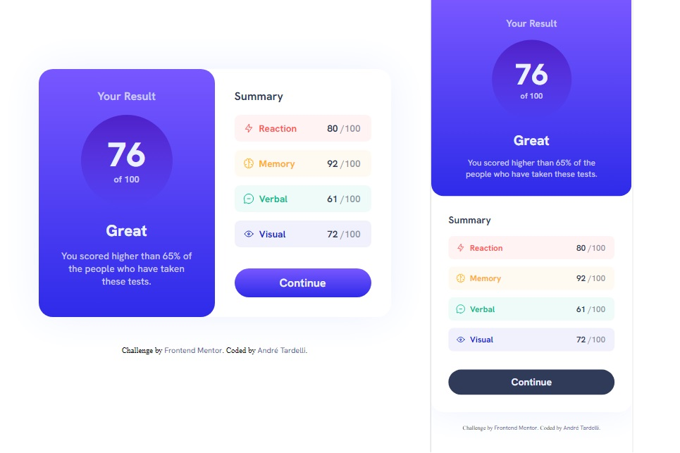

# Frontend Mentor - Solução de componente de resumo de resultados

Esta é uma solução para o [desafio do componente de resumo de resultados no Frontend Mentor](https://www.frontendmentor.io/challenges/results-summary-component-CE_K6s0maV). Os desafios do Frontend Mentor ajudam você a melhorar suas habilidades de codificação criando projetos realistas.

## Índice

- [Visão geral](#visão-geral)
   - [O desafio](#o-desafio)
   - [Captura de tela](#captura-de-tela)
   - [Links](#links)
- [Meu processo](#meu-processo)
   - [Construído com](#construído-com)
   - [O que aprendi](#o-que-aprendi)
   - [Desenvolvimento contínuo](#desenvolvimento-contínuo)
   - [Recursos úteis](#useful-resources)
- [Autor](#autor)
- [Agradecimentos](#acknowledgments)

**Observação: exclua esta observação e atualize o sumário com base nas seções que você mantém.**

## Visão geral

### O desafio

Os usuários devem ser capazes de:

- Veja o layout ideal para a interface, dependendo do tamanho da tela do dispositivo
- Veja os estados de foco e foco para todos os elementos interativos na página

### Captura de tela




### Links

- URL da solução: [Adicionar URL da solução aqui](https://your-solution-url.com)
- URL do site ao vivo: [Adicione URL do site ao vivo aqui](https://your-live-site-url.com)

## Meu processo

### Construído com

- Estrutura HTML5: Incluindo elementos para organizar e exibir corretamente o conteúdo da página.

- Estilização CSS: Aplicação de propriedades como background-color, border-radius, font-size, padding, margin, entre outras. 

- Responsividade; Aplicação de recursos como o media query para adaptar a aparência da página em diferentes tamanhos de tela. No projeto foram utilizados max-width: 460 e 250 px;

- Importação de arquivos: Com a utilização do recurso @import para importar arquivos CSS externos, como feito para definições das cores, organizadas em variáveis (color.css) e estilos tipográficos (typography.css). Essa abordagem foi pensada para facilitar a manutenção, organização e reutilização de estilos em diferentes partes do projetos.

- Uso de seletores: Foram utilizadas classe para maior controle na estilização e criação de estilos personalizados para diferentes partes do projeto.

- Display Flex: Explorado como ferramenta para alinhar e posicionar elementos. Ela foi usada, por exemplo, para centralizar o projeto ao centro do Body.

- Display Grid: Utilazado no projeto para a criação do layouts em grade e organização dos elementos em colunas e linhas, como usado na class="summary".


### O que eu aprendi

Nesse desafio foi possível reforçar os conceitos de organização de pastas, variáveis, classes, entre outros.  Assim, tenho conseguido deixar o código mais limpo e organizado para a manutenção e reutilização do código. 
Da mesma forma, foi dado atenção ao conceito de grid e flexbox, levando em conta sempre a sua importância na organização do projeto, no seu comportamento diantes das diversar configurações e a sua adequação aos diversos tamanhos de tela.

Segue abaixo alguns exemplos.

Utilização de Classes para estilização de Cor e Font.
```html
<h1 class="color-n1 font-m">Your Result</h1>
```
Organização de variáveis para melhor manutenção do codigo
```css
:root {
    /* Color-primary-transparent-boxs */
    --color-pt0: #ff575710;
    --color-pt1: #ffb01f10;
    --color-pt2: #00bd9110;
    --color-pt3: #1125d410;
}
```
Da mesma forma foram criadas class de estilização tipográfica
```css
.font-s {
    font-weight: 500;
}
```

